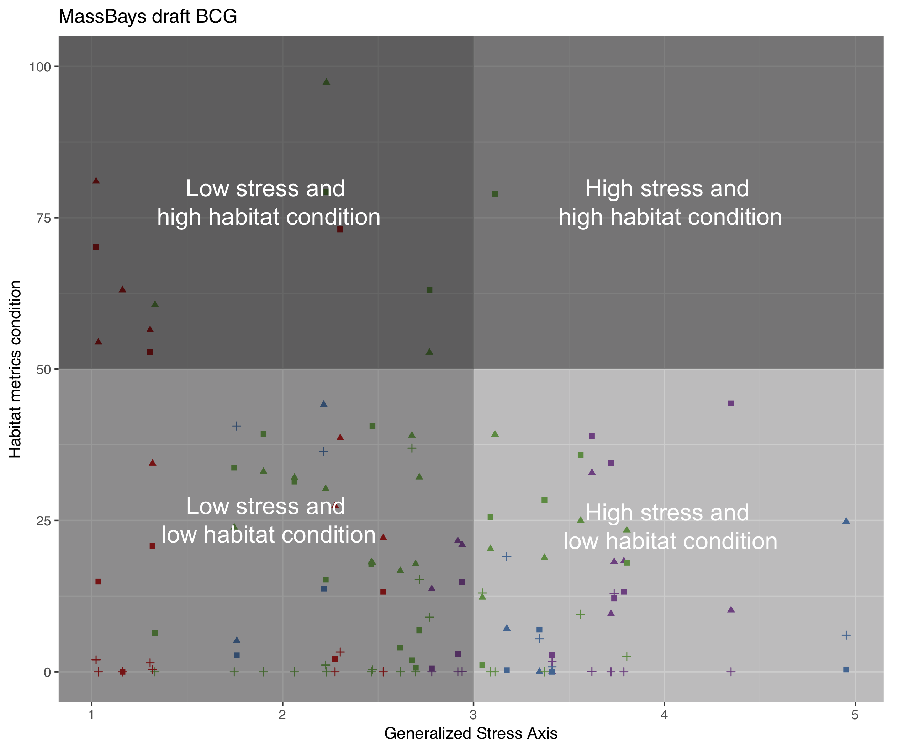

```{r setup, include=FALSE}
knitr::opts_chunk$set(echo = FALSE)

## Load relevant packages
library(dplyr)
library(tidyr)
library(readr)
library(reshape)
library(ggplot2)
library(gridExtra)

## Read in the raw data
d <- read.csv(file = 'data/massbays_rawdata.csv', stringsAsFactors = F)
d <- tbl_df(d)

## Convert the cluster number to a factor
d$Cluster <- factor(d$Cluster)

## a rescale 0-1 function
rescale <- function(x) (x-min(x))/(max(x) - min(x)) 

```

## Stressor Data
Nine stressors variables were incorporated into the Northeastern assessment. To
understand the distribution of values for each stressor throughout MassBays, we
can look at the histograms below.

```{r stressor_hist, echo=FALSE, message=FALSE}

## Generate histograms for stressor data across MassBays
h1 <- ggplot(d, aes(x=hard.of.hard)) + geom_histogram(binwidth=5) +
  theme_minimal() +
  theme(legend.position="none") +
  labs(title="% shoreline hardened")

h2 <- ggplot(d, aes(x=high.intensity)) + geom_histogram(binwidth=5) +
  theme_minimal() +
  theme(legend.position="none") +
  labs(title="% high intensity land use")

h3 <- ggplot(d, aes(x=StormwaterSTD)) + geom_histogram() +
  theme_minimal() +
  theme(legend.position="none") +
  labs(title="Annual stormwater discharge")

h4 <- ggplot(d, aes(x=pop.density)) + geom_histogram() +
  theme_minimal() +
  theme(legend.position="none") +
  labs(title="Persons per acre")

h5 <- ggplot(d, aes(x=percent.septic)) + geom_histogram(binwidth=5) +
  theme_minimal() +
  theme(legend.position="none") +
  labs(title="% using septic systems")

h6 <- ggplot(d, aes(x=septic.acre)) + geom_histogram() +
  theme_minimal() +
  theme(legend.position="none") +
  labs(title="Septic system use")

h7 <- ggplot(d, aes(x=nutrient)) + geom_histogram() +
  theme_minimal() +
  theme(legend.position="none") +
  labs(title="% impairments for nutrients")

h8 <- ggplot(d, aes(x=bacteria)) + geom_histogram(binwidth=5) +
  theme_minimal() +
  theme(legend.position="none") +
  labs(title="% impairments for bacteria")

h9 <- ggplot(d, aes(x=tidal.restrict)) + geom_histogram(binwidth=5) +
  theme_minimal() +
  theme(legend.position="none") +
  labs(title="% restricted saltmarsh")

## Plot all stressor histograms together
grid.arrange(h1, h2, h3, h4, h5, h6, h7, h8, h9, nrow=3)

```

***

Now we want to know how the embayment clusters differ with respect to these 
stressors. We can look at box plots showing the range of values for each 
stressor in each embayment cluster. 

```{r stressor_box, echo=FALSE}

## Generate box plots of the stressors in each embayment cluster

b1 <- ggplot(d, aes(x=Cluster, y=hard.of.hard, fill=Cluster)) + 
  geom_boxplot() +
  scale_fill_brewer(palette="Set1") + theme_minimal() +
  theme(legend.position="none") +
  labs(title="% shoreline hardened")

b2 <- ggplot(d, aes(x=Cluster, y=high.intensity, fill=Cluster)) + 
  geom_boxplot() +
  scale_fill_brewer(palette="Set1") + theme_minimal() +
  theme(legend.position="none") +
  labs(title="% high intensity land use")

b3 <- ggplot(d, aes(x=Cluster, y=StormwaterSTD, fill=Cluster)) + 
  geom_boxplot() +
  scale_fill_brewer(palette="Set1") + theme_minimal() +
  theme(legend.position="none") +
  labs(title="Annual stormwater discharge")

b4 <- ggplot(d, aes(x=Cluster, y=pop.density, fill=Cluster)) + 
  geom_boxplot() +
  scale_fill_brewer(palette="Set1") + theme_minimal() +
  theme(legend.position="none") +
  labs(title="Persons per acre")

b5 <- ggplot(d, aes(x=Cluster, y=percent.septic, fill=Cluster)) + 
  geom_boxplot() +
  scale_fill_brewer(palette="Set1") + theme_minimal() +
  theme(legend.position="none") +
  labs(title="% using septic systems")

b6 <- ggplot(d, aes(x=Cluster, y=septic.acre, fill=Cluster)) + 
  geom_boxplot() +
  scale_fill_brewer(palette="Set1") + theme_minimal() +
  theme(legend.position="none") +
  labs(title="Septic system use")

b7 <- ggplot(d, aes(x=Cluster, y=nutrient, fill=Cluster)) + 
  geom_boxplot() +
  scale_fill_brewer(palette="Set1") + theme_minimal() +
  theme(legend.position="none") +
  labs(title="% impairments for nutrients")

b8 <- ggplot(d, aes(x=Cluster, y=bacteria, fill=Cluster)) + 
  geom_boxplot() +
  scale_fill_brewer(palette="Set1") + theme_minimal() +
  theme(legend.position="none") +
  labs(title="% impairments for bacteria")

b9 <- ggplot(d, aes(x=Cluster, y=tidal.restrict, fill=Cluster)) + 
  geom_boxplot() +
  scale_fill_brewer(palette="Set1") + theme_minimal() +
  theme(legend.position="none") +
  labs(title="% restricted saltmarsh")

## Plot all stressor boxplots together
grid.arrange(b1, b2, b3, b4, b5, b6, b7, b8, b9, nrow=3)

```

***  

## Resource Data (Habitat mosaic components)
Four habitat metrics were examined by Northeastern: two for saltmarsh, one for
seagrass, and one for tidal flats. Three of them are percentages of habitat 
existing with respect to the habitat available. For example, "% realized seagrass" 
is a measure of the acreage of seagrass that exists divided by the total area 
with depths suitable for eelgrass growth. In order to be comparable with the 
others, we rescaled saltmarsh acres on a scale from 0-100. The distribution of 
values for these metrics throughout all MassBays embayments is shown below.  

```{r resources_hist, echo=FALSE, message=FALSE}

## Rescale saltmarsh acress 0-100
d$smacres.km <- rescale(d$smacres.km)*100

## Generate histograms for resource data across MassBays
hA <- ggplot(d, aes(x=percent.sm)) + geom_histogram(binwidth=5) +
  theme_minimal() +
  theme(legend.position="none") +
  labs(title="% realized saltmarsh")

hB <- ggplot(d, aes(x=smacres.km)) + geom_histogram(binwidth=5) +
  theme_minimal() +
  theme(legend.position="none") +
  labs(title="saltmarsh acres/km shoreline")

hC <- ggplot(d, aes(x=tidalflat.openwater)) + geom_histogram() +
  theme_minimal() +
  theme(legend.position="none") +
  labs(title="% realized tidal flats")

hD <- ggplot(d, aes(x=seagrass)) + geom_histogram() +
  theme_minimal() +
  theme(legend.position="none") +
  labs(title="% realized seagrass")


## Plot all resource histograms together
grid.arrange(hA, hB, hC, hD, nrow=2)

```

***  

Now we can also look at the amount of each habitat in each embayment cluster: 

```{r resources_box, echo=FALSE}

## Generate box plots of the resources in each embayment cluster

bA <- ggplot(d, aes(x=Cluster, y=percent.sm, fill=Cluster)) + 
  geom_boxplot() +
  scale_fill_brewer(palette="Set1") + theme_minimal() +
  theme(legend.position="none") +
  labs(title="% realized saltmarsh")

bB <- ggplot(d, aes(x=Cluster, y=smacres.km, fill=Cluster)) + 
  geom_boxplot() +
  scale_fill_brewer(palette="Set1") + theme_minimal() +
  theme(legend.position="none") +
  labs(title="saltmarsh acres/km shoreline")

bC <- ggplot(d, aes(x=Cluster, y=tidalflat.openwater, fill=Cluster)) + 
  geom_boxplot() +
  scale_fill_brewer(palette="Set1") + theme_minimal() +
  theme(legend.position="none") +
  labs(title="% realized tidal flats")

bD <- ggplot(d, aes(x=Cluster, y=seagrass, fill=Cluster)) + 
  geom_boxplot() +
  scale_fill_brewer(palette="Set1") + theme_minimal() +
  theme(legend.position="none") +
  labs(title="% realized seagrass")


## Plot all resource boxplots together
grid.arrange(bA, bB, bC, bD, nrow=2)

```

***  

## Apply these data to a BCG framework
To apply these data to a BCG framework, we'll plot the habitat data for each 
embayment in MassBays against a Generalized Stress Axis (GSA). This will also
allow us to evaluate stressor-habitat characteristics in each embayment and 
cluster. The GSA is not meant to be used to examine causality between stressors
and habitats; it is meant to depict the cumulative stress gradient.

### Developing a draft GSA
We'll use a simple formula to develop a draft GSA for all MassBays embayments
together. First, we'll scale each stressor from 0-1 and then sum those values 
for each embayment in MassBays. Here are the values for a GSA in each cluster:  

```{r gsa, echo=FALSE}

## Rescale each stressor from 0 to 1
rescale_d <- d %>%
    mutate_if(is.numeric, rescale)

## Create a new GSA variable which is the sum of all stressor variables
rescale_d <-mutate(rescale_d, GSA = hard.of.hard + high.intensity 
                   + StormwaterSTD + pop.density + percent.septic + septic.acre
                   + nutrient + bacteria + tidal.restrict)

## Plot of value of GSA in each cluster
bGSA <- ggplot(rescale_d, aes(x=Cluster, y=GSA, fill=Cluster)) + 
  geom_boxplot() +
  scale_fill_brewer(palette="Set1") + theme_minimal() +
  theme(legend.position="none") +
  labs(title="Generalized Stress Axis Value")
bGSA

```

### Assembling a draft BCG for all of MassBays
Now we want to plot the values of the habitat metrics in each MassBays embayment
against the GSA. The resulting plot is very busy because there are 42 embayments 
and 4 habitat metrics in each.

```{r massbaysBCG, echo=FALSE}

## Make a dataframe with the GSA and habitat metrics only
massbaysBCG_data <- data.frame(d$Embayment, d$Cluster, rescale_d$GSA, 
                               d$percent.sm, d$smacres.km, 
                               d$tidalflat.openwater, d$seagrass)

## Rename the habitat metric column names
massbaysBCG_data <- dplyr::rename(massbaysBCG_data,
                            percent_saltmarsh     = d.percent.sm,
                            saltmarsh_acres       = d.smacres.km,
                            percent_tidal_flats   = d.tidalflat.openwater,
                            percent_seagrass      = d.seagrass)
                            

## Melt the data so all habitat metrics can be plotted together
massbaysBCG_melt <- melt(massbaysBCG_data, id = c("d.Embayment", "d.Cluster", 
                                                  "rescale_d.GSA"))

massbaysBCG <- ggplot(massbaysBCG_melt, aes(rescale_d.GSA, value, shape = 
              variable)) + geom_point(aes(color = factor(d.Cluster))) 

massbaysBCG <- massbaysBCG + scale_color_brewer(palette="Set1") + ggtitle("MassBays draft BCG") + 
  xlab("Generalized Stress Axis") + ylab("Habitat metrics condition") +
  labs(color = "Embayment Cluster", shape = "Habitat metric")

massbaysBCG

```

The plot can be simplified a number of ways. For example, each quadrant of the
BCG represents a unique combination of stressor and habitat characteristics.  

<p align="center">
</a> 
</p>

### Individual BCG plots of each habitat type
Another way to simplify is to look at a BCG plot for each habitat type 
separately. We can see that Saltmarsh acres per km shoreline has the most linear
relationship with the GSA.

```{r habitats, echo=FALSE}

## Filter each habitat from the full dataset
massbays_per_saltmarsh <- filter(massbaysBCG_melt, variable == "percent_saltmarsh")
massbays_saltmarsh_acres <- filter(massbaysBCG_melt, variable == "saltmarsh_acres")
massbays_tidal <- filter(massbaysBCG_melt, variable == "percent_tidal_flats")
massbays_seagrass <- filter(massbaysBCG_melt, variable == "percent_seagrass")

## Make a BCG plot for each habitat individually
massbaysBCG_per_saltmarsh <- ggplot(massbays_per_saltmarsh, aes(rescale_d.GSA, value, color = 
              d.Cluster)) + geom_point() + scale_color_brewer(palette="Set1") +
              ggtitle("Percent saltmarsh") + xlab("Generalized Stress Axis") + 
              ylab("Habitat metrics condition") + labs(shape = "Habitat metric") +
              xlim(1,5) + ylim(0,100) + theme(legend.position="none")

massbaysBCG_saltmarsh_acres <- ggplot(massbays_saltmarsh_acres, aes(rescale_d.GSA, 
              value, color = d.Cluster)) + geom_point(shape = 17) +
              scale_color_brewer(palette="Set1") +
              ggtitle("Saltmarsh acres per km shoreline") + xlab("Generalized Stress Axis") + 
              ylab("Habitat metrics condition") + labs(shape = "Habitat metric") +
              xlim(1,5) + ylim(0,100) + theme(legend.position="none")

massbaysBCG_tidal <- ggplot(massbays_tidal, aes(rescale_d.GSA, value, color = 
              d.Cluster)) + geom_point(shape = 15) + scale_color_brewer(palette="Set1") +
              ggtitle("Percent tidal flats") + xlab("Generalized Stress Axis") + 
              ylab("Habitat metrics condition") + labs(shape = "Habitat metric") +
              xlim(1,5) + ylim(0,100) + theme(legend.position="none")
            
massbaysBCG_seagrass <- ggplot(massbays_seagrass, aes(rescale_d.GSA, value, color = 
              d.Cluster)) + geom_point(shape = 3) + scale_color_brewer(palette="Set1") +
              ggtitle("Percent seagrass") + xlab("Generalized Stress Axis") + 
              ylab("Habitat metrics condition") + labs(shape = "Habitat metric") +
              xlim(1,5) + ylim(0,100) + theme(legend.position="none")

grid.arrange(massbaysBCG_per_saltmarsh, massbaysBCG_saltmarsh_acres, 
             massbaysBCG_tidal, massbaysBCG_seagrass, nrow = 2)

```


### Individual BCG plots for each embayment type
More likely, we would want to look at a BCG plot of each embayment cluster 
separately. We can clearly see that the ranges of stressors and habitats differs 
among clusters. For example, Cluster 1 seems to be comprised of embayments with
low exposure to stressors (the GSA is never greater than 3). On the other hand, 
despite high levels of exposure to stressors (the GSA is never less than about 
2.5), Cluster 4 shows relatively high values for percent saltmarsh habitat.  

```{r four_bcgs, echo=FALSE}

## Filter each cluster from the full dataset
massbays_cluster_1 <- filter(massbaysBCG_melt, d.Cluster == 1)
massbays_cluster_2 <- filter(massbaysBCG_melt, d.Cluster == 2)
massbays_cluster_3 <- filter(massbaysBCG_melt, d.Cluster == 3)
massbays_cluster_4 <- filter(massbaysBCG_melt, d.Cluster == 4)

## Make a BCG plot for each cluster individually
massbaysBCG_1 <- ggplot(massbays_cluster_1, aes(rescale_d.GSA, value, shape = 
              variable)) + geom_point(color="#e41a1c") + 
              ggtitle("Cluster 1 draft BCG") + xlab("Generalized Stress Axis") + 
              ylab("Habitat metrics condition") + labs(shape = "Habitat metric") +
              xlim(1,5) + ylim(0,100)

massbaysBCG_2 <- ggplot(massbays_cluster_2, aes(rescale_d.GSA, value, shape = 
              variable)) + geom_point(color = "#377eb8") + 
              ggtitle("Cluster 2 draft BCG") + xlab("Generalized Stress Axis") + 
              ylab("Habitat metrics condition") + labs(shape = "Habitat metric") +
              xlim(1,5) + ylim(0,100)

massbaysBCG_3 <- ggplot(massbays_cluster_3, aes(rescale_d.GSA, value, shape = 
              variable)) + geom_point(color = "#4daf4a") + 
              ggtitle("Cluster 3 draft BCG") + xlab("Generalized Stress Axis") + 
              ylab("Habitat metrics condition") + labs(shape = "Habitat metric") +
              xlim(1,5) + ylim(0,100)

massbaysBCG_4 <- ggplot(massbays_cluster_4, aes(rescale_d.GSA, value, shape = 
              variable)) + geom_point(color = "#984ea3") + 
              ggtitle("Cluster 4 draft BCG") + xlab("Generalized Stress Axis") + 
              ylab("Habitat metrics condition") + labs(shape = "Habitat metric") +
              xlim(1,5) + ylim(0,100)

grid.arrange(massbaysBCG_1, massbaysBCG_2, massbaysBCG_3, massbaysBCG_4, nrow = 2)

```

## Summary
What we've done so far is explore the stressors and habitat metrics within the 
bounds of MassBays as a whole. In doing so, we've shown that there are real 
differences among clusters that could be considered when assembling new draft 
BCGs.  

In addition, these BCGs only consider the present range of stressor and 
habitat values captured in the EDA2.0.  

The Northeastern analysis identified which stressors are most predictive of 
habitat condition. Shoreline hardening and septic system use were 
able to predict percent saltmarsh; population density and shoreline hardening 
could predict saltmarsh acres per km shoreline. One option is to have future 
iterations of the BCG use only those stressors as inputs to a GSA.  

Alternatively, the highest 3 stressors in each embayment cluster could be used 
to develop custom GSAs for each cluster.  


