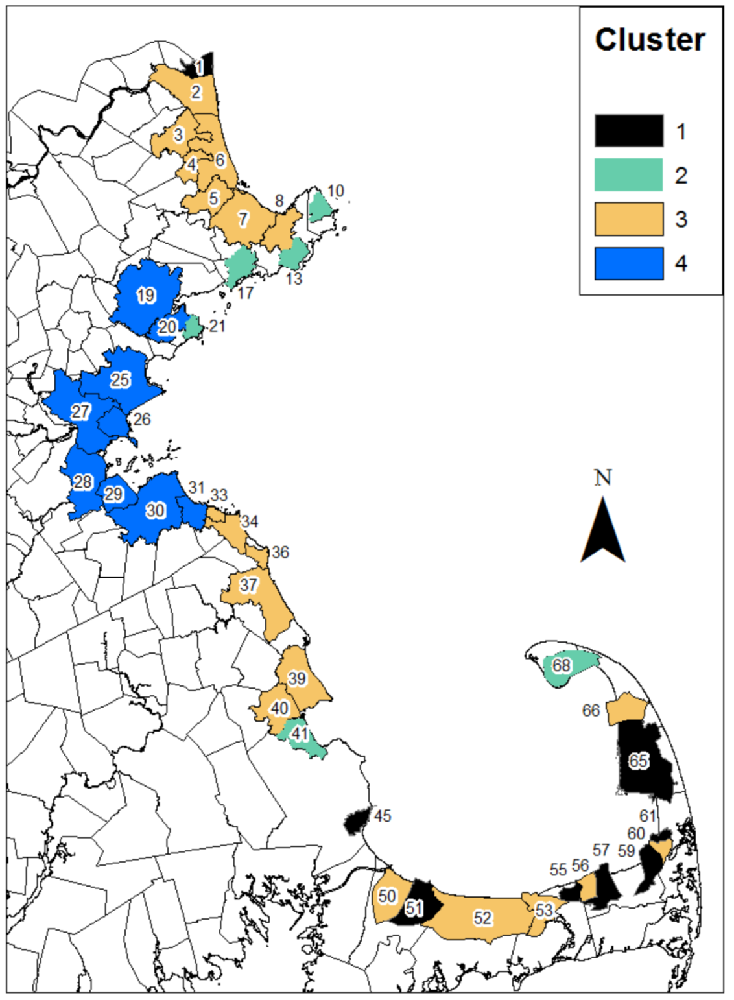

```{r setup, include=FALSE}
knitr::opts_chunk$set(echo = FALSE)

## Load relevant packages
library(dplyr)
library(tidyr)
library(readr)
library(reshape)
library(ggplot2)
library(gridExtra)
library(knitr)

## Read in the raw data
d <- read.csv(file = 'data/massbays_rawdata.csv', stringsAsFactors = FALSE)
d <- tbl_df(d)

## Convert the cluster number to a factor
d$Cluster <- factor(d$Cluster)

## a rescale 0-1 function
rescale <- function(x) (x-min(x))/(max(x) - min(x)) 

## define the colors for each cluster as used in the Northeastern report
colors <- palette(c("black", "aquamarine3", "darkgoldenrod1", "blue"))

```

## Embayment clusters
There are 4 clusters of embayments in MassBays, defined by the Northeastern 
assessment. Below they are described by which stressor and habitat metrics were 
highest in each.  

<div style="float: left; padding: 10px">

 

</div>

**Cluster 1**  
- highest saltmarsh extent  
- highest tidal flat area  

**Cluster 2**  
- highest hardened shoreline  
- highest seagrass extent  

**Cluster 3**  
- highest saltmarsh shoreline  
- highest impairment for nutrients  

**Cluster 4**  
- highest high-intensity land use  
- highest population density  
- highest tidal restriction  


## Stressor Data
Nine stressors variables were incorporated into the Northeastern assessment.  

```{r stressor_table, echo = FALSE, message = FALSE}

# Read in the table of stressors and their definitions
stressors_def <- read.csv(file = "data/stressors_definitions.csv", stringsAsFactors = FALSE)

# Make a table to display
kable(stressors_def, caption = "Stressor variables")

```


To understand the distribution of values for each stressor throughout MassBays, we
can look at the histograms below.

```{r stressor_hist, echo = FALSE, message = FALSE}

## Generate histograms for stressor data across MassBays
h1 <- ggplot(d, aes(x=hard.of.hard)) + geom_histogram(binwidth=5) +
  theme_minimal() +
  theme(legend.position="none", axis.title.x = element_blank(), axis.title.y = 
          element_blank(), plot.title = element_text(size = 10)) +
  labs(title="% shoreline hardened")

h2 <- ggplot(d, aes(x=high.intensity)) + geom_histogram(binwidth=5) +
  theme_minimal() +
  theme(legend.position="none", axis.title.x = element_blank(), axis.title.y = 
          element_blank(), plot.title = element_text(size = 10)) +
  labs(title="% high intensity land use")

h3 <- ggplot(d, aes(x=StormwaterSTD)) + geom_histogram() +
  theme_minimal() +
  theme(legend.position="none", axis.title.x = element_blank(), axis.title.y = 
          element_blank(), plot.title = element_text(size = 10)) +
  labs(title="Annual stormwater discharge")

h4 <- ggplot(d, aes(x=pop.density)) + geom_histogram() +
  theme_minimal() +
  theme(legend.position="none", axis.title.x = element_blank(), axis.title.y = 
          element_blank(), plot.title = element_text(size = 10)) +
  labs(title="Persons per acre")

h5 <- ggplot(d, aes(x=percent.septic)) + geom_histogram(binwidth=5) +
  theme_minimal() +
  theme(legend.position="none", axis.title.x = element_blank(), axis.title.y = 
          element_blank(), plot.title = element_text(size = 10)) +
  labs(title="% using septic systems")

h6 <- ggplot(d, aes(x=septic.acre)) + geom_histogram() +
  theme_minimal() +
  theme(legend.position="none", axis.title.x = element_blank(), axis.title.y = 
          element_blank(), plot.title = element_text(size = 10)) +
  labs(title="Septic system use")

h7 <- ggplot(d, aes(x=nutrient)) + geom_histogram() +
  theme_minimal() +
  theme(legend.position="none", axis.title.x = element_blank(), axis.title.y = 
          element_blank(), plot.title = element_text(size = 10)) +
  labs(title="% impairments for nutrients")

h8 <- ggplot(d, aes(x=bacteria)) + geom_histogram(binwidth=5) +
  theme_minimal() +
  theme(legend.position="none", axis.title.x = element_blank(), axis.title.y = 
          element_blank(), plot.title = element_text(size = 10)) +
  labs(title="% impairments for bacteria")

h9 <- ggplot(d, aes(x=tidal.restrict)) + geom_histogram(binwidth=5) +
  theme_minimal() +
  theme(legend.position="none", axis.title.x = element_blank(), axis.title.y = 
          element_blank(), plot.title = element_text(size = 10)) +
  labs(title="% restricted saltmarsh")

## Plot all stressor histograms together
grid.arrange(h1, h2, h3, h4, h5, h6, h7, h8, h9, nrow=3)

## Save the resulting 9x9 plot
stressors_hists <- arrangeGrob(h1, h2, h3, h4, h5, h6, h7, h8, h9, nrow=3)
ggsave(file="as_presented_figs/stressors_hists.png", stressors_hists)

```

***

Now we want to know how the embayment clusters differ with respect to these 
stressors. We can look at box plots showing the range of values for each 
stressor in each embayment cluster 1 - 4. 

```{r stressor_box, echo = FALSE, message = FALSE}

## Generate box plots of the stressors in each embayment cluster

b1 <- ggplot(d, aes(x=Cluster, y=hard.of.hard, fill=Cluster)) + 
  geom_boxplot() +
  scale_fill_manual(values=colors) + theme_minimal() +
  theme(legend.position="none", axis.title.x = element_blank(), axis.title.y = 
          element_blank(), plot.title = element_text(size = 10)) +
  labs(title="% shoreline hardened")

b2 <- ggplot(d, aes(x=Cluster, y=high.intensity, fill=Cluster)) + 
  geom_boxplot() +
  scale_fill_manual(values=colors) + theme_minimal() +
  theme(legend.position="none", axis.title.x = element_blank(), axis.title.y = 
          element_blank(), plot.title = element_text(size = 10)) +
  labs(title="% high intensity land use")

b3 <- ggplot(d, aes(x=Cluster, y=StormwaterSTD, fill=Cluster)) + 
  geom_boxplot() +
  scale_fill_manual(values=colors) + theme_minimal() +
  theme(legend.position="none", axis.title.x = element_blank(), axis.title.y = 
          element_blank(), plot.title = element_text(size = 10)) +
  labs(title="Annual stormwater discharge")

b4 <- ggplot(d, aes(x=Cluster, y=pop.density, fill=Cluster)) + 
  geom_boxplot() +
  scale_fill_manual(values=colors) + theme_minimal() +
  theme(legend.position="none", axis.title.x = element_blank(), axis.title.y = 
          element_blank(), plot.title = element_text(size = 10)) +
  labs(title="Persons per acre")

b5 <- ggplot(d, aes(x=Cluster, y=percent.septic, fill=Cluster)) + 
  geom_boxplot() +
  scale_fill_manual(values=colors) + theme_minimal() +
  theme(legend.position="none", axis.title.x = element_blank(), axis.title.y = 
          element_blank(), plot.title = element_text(size = 10)) +
  labs(title="% using septic systems")

b6 <- ggplot(d, aes(x=Cluster, y=septic.acre, fill=Cluster)) + 
  geom_boxplot() +
  scale_fill_manual(values=colors) + theme_minimal() +
  theme(legend.position="none", axis.title.x = element_blank(), axis.title.y = 
          element_blank(), plot.title = element_text(size = 10)) +
  labs(title="Septic system use")

b7 <- ggplot(d, aes(x=Cluster, y=nutrient, fill=Cluster)) + 
  geom_boxplot() +
  scale_fill_manual(values=colors) + theme_minimal() +
  theme(legend.position="none", axis.title.x = element_blank(), axis.title.y = 
          element_blank(), plot.title = element_text(size = 10)) +
  labs(title="% impairments for nutrients")

b8 <- ggplot(d, aes(x=Cluster, y=bacteria, fill=Cluster)) + 
  geom_boxplot() +
  scale_fill_manual(values=colors) + theme_minimal() +
  theme(legend.position="none", axis.title.x = element_blank(), axis.title.y = 
          element_blank(), plot.title = element_text(size = 10)) +
  labs(title="% impairments for bacteria")

b9 <- ggplot(d, aes(x=Cluster, y=tidal.restrict, fill=Cluster)) + 
  geom_boxplot() +
  scale_fill_manual(values=colors) + theme_minimal() +
  theme(legend.position="none", axis.title.x = element_blank(), axis.title.y = 
          element_blank(), plot.title = element_text(size = 10)) +
  labs(title="% restricted saltmarsh")

## Plot all stressor boxplots together
grid.arrange(b1, b2, b3, b4, b5, b6, b7, b8, b9, nrow=3)

## Save the resulting 9x9 plot
stressors_boxes <- arrangeGrob(b1, b2, b3, b4, b5, b6, b7, b8, b9, nrow=3)
ggsave(file="as_presented_figs/stressors_boxes.png", stressors_boxes)

```

***  

## Resource Data (Habitat mosaic components)
Four habitat metrics were examined by Northeastern: two for saltmarsh, one for
seagrass, and one for tidal flats. Three of them are percentages of habitat 
existing with respect to the habitat available. For example, "% realized seagrass" 
is a measure of the acreage of seagrass that exists divided by the total area 
with depths suitable for eelgrass growth. In order to be comparable with the 
others, we rescaled saltmarsh acres on a scale from 0-100.  

```{r resources_table, echo = FALSE, message = FALSE}

# Read in the table of stressors and their definitions
resources_def <- read.csv(file = "data/resources_definitions.csv", stringsAsFactors = FALSE)

# Make a table to display
kable(resources_def, caption = "Resource variables")

```

The distribution of values for these metrics throughout all MassBays embayments 
is shown below.  

```{r resources_hist, echo = FALSE, message = FALSE}

## Rescale saltmarsh acress 0-100
d$smacres.km <- rescale(d$smacres.km)*100

## Generate histograms for resource data across MassBays
hA <- ggplot(d, aes(x=percent.sm)) + geom_histogram(binwidth=5) +
  theme_minimal() +
  theme(legend.position="none", axis.title.x = element_blank(), axis.title.y = 
          element_blank(), plot.title = element_text(size = 10)) +
  labs(title="saltmarsh shoreline")

hB <- ggplot(d, aes(x=smacres.km)) + geom_histogram(binwidth=5) +
  theme_minimal() +
  theme(legend.position="none", axis.title.x = element_blank(), axis.title.y = 
          element_blank(), plot.title = element_text(size = 10)) +
  labs(title="saltmarsh extent")

hC <- ggplot(d, aes(x=tidalflat.openwater)) + geom_histogram() +
  theme_minimal() +
  theme(legend.position="none", axis.title.x = element_blank(), axis.title.y = 
          element_blank(), plot.title = element_text(size = 10)) +
  labs(title="% realized tidal flats")

hD <- ggplot(d, aes(x=seagrass)) + geom_histogram() +
  theme_minimal() +
  theme(legend.position="none", axis.title.x = element_blank(), axis.title.y = 
          element_blank(), plot.title = element_text(size = 10)) +
  labs(title="% realized seagrass")


## Plot all resource histograms together
grid.arrange(hA, hB, hC, hD, nrow=2)

## Save the resulting 2x2 plot
resources_hists <- arrangeGrob(hA, hB, hC, hD, nrow=2)
ggsave(file="as_presented_figs/resources_hists.png", resources_hists)

```

***  

Now we can also look at the amount of each habitat in each embayment cluster 1 - 
4: 

```{r resources_box, echo = FALSE, message = FALSE}

## Generate box plots of the resources in each embayment cluster

bA <- ggplot(d, aes(x=Cluster, y=percent.sm, fill=Cluster)) + 
  geom_boxplot() +
  scale_fill_manual(values=colors) + theme_minimal() +
  theme(legend.position="none", axis.title.x = element_blank(), axis.title.y = 
          element_blank(), plot.title = element_text(size = 10)) +
  labs(title="saltmarsh shoreline")

bB <- ggplot(d, aes(x=Cluster, y=smacres.km, fill=Cluster)) + 
  geom_boxplot() +
  scale_fill_manual(values=colors) + theme_minimal() +
  theme(legend.position="none", axis.title.x = element_blank(), axis.title.y = 
          element_blank(), plot.title = element_text(size = 10)) +
  labs(title="saltmarsh extent")

bC <- ggplot(d, aes(x=Cluster, y=tidalflat.openwater, fill=Cluster)) + 
  geom_boxplot() +
  scale_fill_manual(values=colors) + theme_minimal() +
  theme(legend.position="none", axis.title.x = element_blank(), axis.title.y = 
          element_blank(), plot.title = element_text(size = 10)) +
  labs(title="% realized tidal flats")

bD <- ggplot(d, aes(x=Cluster, y=seagrass, fill=Cluster)) + 
  geom_boxplot() +
  scale_fill_manual(values=colors) + theme_minimal() +
  theme(legend.position="none", axis.title.x = element_blank(), axis.title.y = 
          element_blank(), plot.title = element_text(size = 10)) +
  labs(title="% realized seagrass")


## Plot all resource boxplots together
grid.arrange(bA, bB, bC, bD, nrow=2)

## Save the resulting 2x2 plot
resources_boxes <- arrangeGrob(bA, bB, bC, bD, nrow=2)
ggsave(file="as_presented_figs/resources_boxes.png", resources_boxes)

```

***  

## Apply these data to a BCG framework
To apply these data to a BCG framework, we'll plot the habitat data for each 
embayment in MassBays against a Generalized Stress Axis (GSA). This will also
allow us to evaluate stressor-habitat characteristics in each embayment and 
cluster. The GSA is not meant to be used to examine causality between stressors
and habitats; it is meant to depict the cumulative stress gradient.

### Developing a draft GSA
We'll use a simple formula to develop a draft GSA for all MassBays embayments
together. First, we'll scale each stressor from 0-1 and then sum those values 
for each embayment in MassBays. Here are the values for a GSA in each cluster:  

```{r gsa, echo = FALSE, message = FALSE}

## Rescale each stressor from 0 to 1
rescale_d <- d %>%
    mutate_if(is.numeric, rescale)

## Create a new GSA variable which is the sum of all stressor variables
rescale_d <-mutate(rescale_d, GSA = hard.of.hard + high.intensity 
                   + StormwaterSTD + pop.density + percent.septic + septic.acre
                   + nutrient + bacteria + tidal.restrict)

## Plot of value of GSA in each cluster
bGSA <- ggplot(rescale_d, aes(x=Cluster, y=GSA, fill=Cluster)) + 
  geom_boxplot() +
  scale_fill_manual(values=colors) + theme_minimal() +
  theme(legend.position="none") +
  labs(title="Generalized Stress Axis Value")
bGSA

## Save the resulting plot
ggsave(file="as_presented_figs/GSA_boxplot.png", bGSA)

## Flip and save the plot with the GSA on the x axis
bGSA_flip <- bGSA + coord_flip()

ggsave(file="as_presented_figs/GSA_boxplot_flip.png", bGSA_flip)

```

### Individual "BCG-like" plots for each embayment type
Now we want to plot the values of the habitat metrics against the GSA for each 
MassBays embayment cluster separately. Doing so creates individual "BCG-like" 
plots for each cluster. Embayment clusters are plotted below and numbered 1-4. 
We can clearly see that the ranges of stressors and habitats differs among 
clusters. For example, Cluster 1 seems to be comprised of embayments with low 
exposure to stressors (the GSA is never greater than 3). On the other hand, 
despite high levels of exposure to stressors (the GSA is never less than about 
2.5), Cluster 4 shows relatively high values for percent saltmarsh habitat.  

```{r embayments, echo = FALSE, message = FALSE}

## Make a dataframe with the GSA and habitat metrics only
massbaysBCG_data <- data.frame(d$Embayment, d$Cluster, rescale_d$GSA, 
                               d$percent.sm, d$smacres.km, 
                               d$tidalflat.openwater, d$seagrass)

## Rename the habitat metric column names
massbaysBCG_data <- dplyr::rename(massbaysBCG_data,
                            saltmarsh_shoreline     = d.percent.sm,
                            saltmarsh_extent       = d.smacres.km,
                            percent_tidal_flats   = d.tidalflat.openwater,
                            percent_seagrass      = d.seagrass)
                            

## Melt the data so all habitat metrics can be plotted together
massbaysBCG_melt <- melt(massbaysBCG_data, id = c("d.Embayment", "d.Cluster", 
                                                  "rescale_d.GSA"))

## Make a "BCG-like" plot for each Embayment cluster individually
embaymentBCGs <- ggplot(massbaysBCG_melt, aes(rescale_d.GSA, value, color = d.Cluster, shape = 
          variable)) + geom_point() +
          xlab("Generalized Stress Axis") +
          ylab("Habitat metrics condition") + 
          scale_color_manual(values=colors, guide = "none") + 
          labs(shape = "Habitat metric") +
          facet_wrap(~ d.Cluster)

embaymentBCGs

## Save the plot
ggsave(file="as_presented_figs/draft_embaymentBCGs.png", embaymentBCGs)

```

### Individual "BCG-like" plots of each habitat type
To get a clearer idea for whether or not there are linear (or any) relationships 
between individual habitat metrics and the GSA, we can plot each of the habitats 
separately against the GSA, for all MassBays embayments. Again, the y-axis does 
not have BCG levels, but these could be developed.  

We can see that Saltmarsh extent has the most linear relationship with the GSA.

```{r habitats, echo = FALSE, message = FALSE}

## Make a "BCG-like" plot for each habitat individually
habitatBCGs <- ggplot(massbaysBCG_melt, aes(rescale_d.GSA, value, color = d.Cluster, shape = 
              variable)) + geom_point() +
              xlab("Generalized Stress Axis") +
              ylab("Habitat metrics condition") + 
              scale_color_manual(values=colors) + 
              labs(color = "Embayment Cluster") + scale_shape(guide = 'none') +
              facet_wrap(~ variable)
habitatBCGs

## Save the plot
ggsave(file="as_presented_figs/draft_habitatBCGs.png", habitatBCGs)

```


## Summary and Questions to Consider
What we've done so far is explore the stressors and habitat metrics within the 
bounds of MassBays as a whole. In doing so, we've shown that there are real 
differences among clusters that could be considered when assembling BCGs for 
each embayment.  

It's important to note that these BCGs only consider the present range of 
stressor and habitat values captured in the EDA 2.0. Revised BCGs for each
embayment cluster could consider historical conditions (whether that be recent historical, 
pre-industrial, etc.), and additional habitat metrics and/or stressor metrics.  

### Questions to consider  

1. How can additional stressor and/or habitat metrics be included in the BCGs
(e.g., water quality, contaminants)? Any EDA 2.0 dataset could be plotted on an 
embayment cluster's BCG plot.  

2. How should the GSA be revised?  
..* Should all nine stressors be included and weighted equally?  
..* Develop cluster-specific GSAs by using/weighting only those stressors most 
relevant to the cluster?  
..* Use/weight only those stressors with quantitative relationships to the 
resource variables as described by the Northeastern regression trees?  
..* How should/can historical conditions be included?  

3. How can breaks between condition levels be defined? How should "Level 1" be 
defined and by whom?  

4. Should restoration/conservation targets be based on present range of data in 
each cluster (e.g., cluster mean or max, as suggested in Northeastern report) or 
can they also be informed by additional (e.g., historical) data?